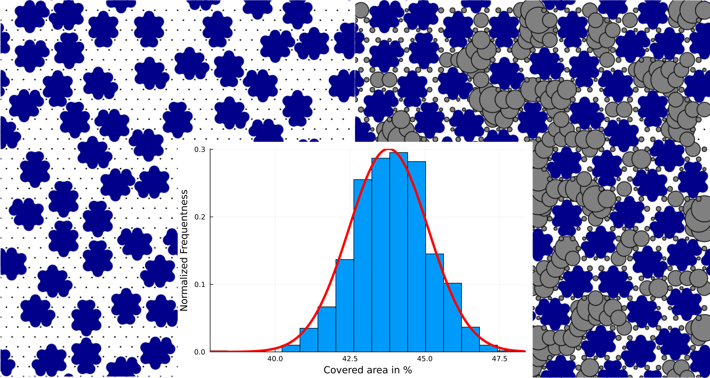

# About RSA 
As the name indicates *random sequential adsorption* or simply *RSA* simulations are mainly used to model adsorption events whereby the behaviour of the adsorbates is assumed to be random. This is a crude approximation but still somewhat valid for weakly interacting adsorbates. 

Within the area-selective deposition, a core research question is to judge how well a surface - usualle called the *non-growth surface* - can be shielded or blocked by an adsorbate. Here, RSA simulations can help to derive an model for the blocking layer formed by the adsorbates. Furthermore, a first guess of how large the remaining gaps are can be derived.  

In addition to the presence of adsorption events, this RSA package also includes the possibility of rotation, diffusion, and conversion events. Thereby, the present algorithm is slightly moving in the direction of a light version of a kinetic Monte-Carlo (kMC) algorithm.

## Core Steps
- Reduce an adsorbate to its van-der-Waal spheres.
- Represent a surface by a grid. Each gridpoint represents a possible adsorption site.
- Repeatedly perform randomly selected events.
- Terminate the simulation once a sufficient number of steps were performed or the number of adsorbates is converged.
- Repeat the RSA simulations to gain statistical informations.

## Core Asumptions
- Adsorbates do not overlap with their van-der-Waals spheres.
- Adsorbates randomly adsorb with a sticking coefficient of 1.
- All events happen in sequence and not simultanously.
- There is no chemical interaction between adsorbates or to the surface. That includes attractive and repulsive interactions changing the preference for a closed or sparse packing as well as changes in the sticking coefficient based on coverage. 
- Adsorbates never desorb.

## Use Cases
- Obtain a limit for the surface coverage of the blocking layer.
- Obtain a size limit for precursors, which are still small enough to penetrate the blocking layer.
- Screen a set of adsorbates to find the adsorbate with the highest surface coverage.
- Search for combinations of adsorbates and a pulse sequence to improve surface coverage.


```@raw html
<p style="text-align: center;">Random adsorption of adsorbates (blue spheres) with gap sizes (grey circles).</p>
```